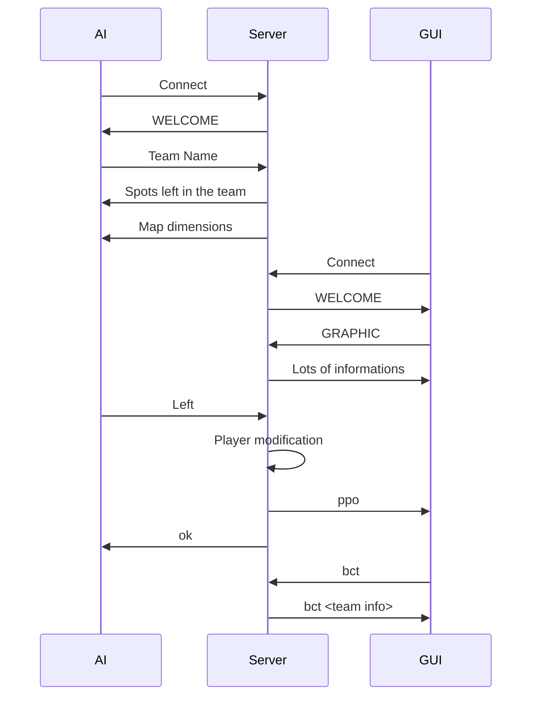

# Protocol Communication

Here's how protocol communication works within Zappy:

Firstly there's a handshake between the AI and the server to check for the team.

Once this is completed, anytime there's a modification that requires the GUI to be notified, the server sends over information to all GUI clients.

Most AI commands need to wait for the time limit to expire to be executed.

For example, the `Left` commands needs 7 cycles before being executed.

GUI commands are not subject to this.

---

Below is a simplified communication between AI, Server and GUI.

The AI connect and sends `Left` command.

The GUI connect and sends `bct` command.

