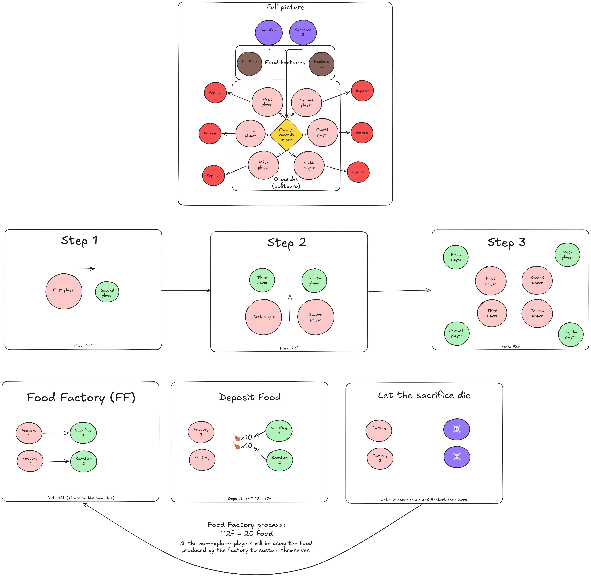

# Strategy

## Context

The Zappy AI's goal is to reach level 8 as fast as possible.

In order to reach this goal, there must be at least 6 players reaching level 7 and then elevating together.

The game works by frames, meaning that each action a player does, takes x frames to complete.

To incantate, a player needs the necessary minerals for each level of elevation.

An incantation takes 300f (frames).

Over the course of its life, a player will consume food. Each unit of food lasts for 120f.

By taking the actions of looking (7f), moving (7f) and taking objects (7f), a player can gather those minerals and food, and eventually use them (via incantation) or set them down (7f).

So, a team's goal is to have 6 of its players reach level 8, effectively ending the simulation.

Consequently, a team will try to dispatch its players effectively in order to gather ressources as quick as possible and begin elevating ASAP.

## P.O.C.: Perfected Oligarch Communism

The strategy is set around a main group which will be the one elevating, and a subgroup, bred by the main group, and whose job will be to gather ressources for the main group.

This schema explains the architecture and the steps taken by the algorithm:

Resources needed to elevate:
| Elevation Lvl | Players | linemate | deraumere | sibur | mendiane | phiras | thystame |
| ------------- | ------- | -------- | --------- | ----- | -------- | ------ | -------- |
|      2        | 1       | 1        | 0         | 0     | 0        | 0      | 0        |
|      3        | 2       | 1        | 1         | 1     | 0        | 0      | 0        |
|      4        | 1       | 2        | 0         | 1     | 0        | 2      | 0        |
|      5        | 1       | 1        | 1         | 2     | 0        | 1      | 0        |
|      6        | 1       | 1        | 2         | 1     | 3        | 0      | 0        |
|      7        | 1       | 1        | 2         | 3     | 0        | 1      | 0        |
|      8        | 1       | 2        | 2         | 2     | 2        | 2      | 1        |