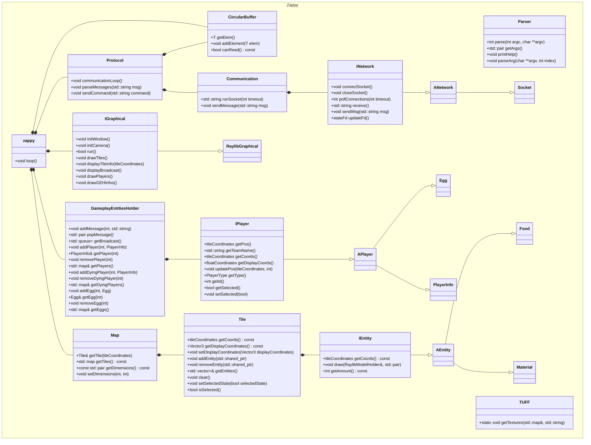

# Architecture

This document represents the architecture of the GUI part of the Zappy.

```mermaid
classDiagram
    namespace Zappy {
        class Parser {
            +int parse(int argc, char **argv)
            +std::pair<int, std::string> getArgs()
            +void printHelp()
            +void parseArg(char **argv, int index)
        }

        %% Lowercase due to collision with namespace
        class zappy {
            +void loop()
        }

        class Map {
            +Tile& getTile(tileCoordinates)
            +std::map<tileCoordinates, Tile> getTiles() const
            +const std::pair<int, int> getDimensions() const
            +void setDimensions(int, int)
        }

        class Tile {
            +tileCoordinates getCoords() const
            +Vector3 getDisplayCoordinates() const
            +void setDisplayCoordinates(Vector3 displayCoordinates)
            +void addEntity(std::shared_ptr<IEntity>)
            +void removeEntity(std::shared_ptr<IEntity>)
            +std::vector<std::shared_ptr<IEntity>>& getEntities()
            +void clear()
            +void setSelectedState(bool selectedState)
            +bool isSelected()
        }

        %% Network related
        class CircularBuffer {
            +T getElem()
            +void addElement(T elem)
            +bool canRead() const
        }

        class Protocol {
            +void communicationLoop()
            +void parseMessages(std::string msg)
            +void sendCommand(std::string command)
        }

        class Communication {
            +std::string runSocket(int timeout)
            +void sendMessage(std::string msg)
        }

        class INetwork {
            +void connectSocket()
            +void closeSocket()
            +int pollConnections(int timeout)
            +std::string receive()
            +void sendMsg(std::string msg)
            +stateFd updateFd()
        }

        class ANetwork {}

        class Socket {}

        %% Graphical related
        class GameplayEntitiesHolder {
            +void addMessage(int, std::string)
            +std::pair<int, std::string> popMessage()
            +std::queue<std::pair<int, std::string>> getBroadcast()
            +void addPlayer(int, PlayerInfo)
            +PlayerInfo& getPlayer(int)
            +void removePlayer(int)
            +std::map<int, PlayerInfo>& getPlayers()
            +void addDyingPlayer(int, PlayerInfo)
            +void removeDyingPlayer(int)
            +std::map<int, PlayerInfo>& getDyingPlayers()
            +void addEgg(int, Egg)
            +Egg& getEgg(int)
            +void removeEgg(int)
            +std::map<int, Egg>& getEggs()
        }

        class IGraphical {
            +void initWindow()
            +void initCamera()
            +bool run()
            +void drawTiles()
            +void displayTileInfo(tileCoordinates)
            +void displayBroadcast()
            +void drawPlayers()
            +void drawGEHInfos()
        }

        class RaylibGraphical {}

        class TUFF {
            +static void getTextures(std::map<int, raylib::Texture2D>&, std::string)
        }

        %% Player related
        class IPlayer {
            +tileCoordinates getPos()
            +std::string getTeamName()
            +tileCoordinates getCoords()
            +floatCoordinates getDisplayCoords()
            +void updatePos(tileCoordinates, int)
            +PlayerType getType()
            +int getId()
            +bool getSelected()
            +void setSelected(bool)
        }

        class APlayer {}

        class Egg {}

        class PlayerInfo {}

        %% Entities related
        class IEntity {
            +tileCoordinates getCoords() const
            +void draw(RaylibModelHolder&, std::pair<int, int>)
            +int getAmount() const
        }

        class AEntity {}

        class Food {}

        class Material {}
    }

    zappy *-- Map
    zappy *-- GameplayEntitiesHolder
    zappy *-- CircularBuffer
    zappy *-- Protocol
    zappy *-- IGraphical

    Map *-- Tile
    Tile *-- IEntity

    IGraphical --|> RaylibGraphical

    Protocol *-- CircularBuffer
    Protocol *-- Communication
    Communication *-- INetwork

    INetwork --|> ANetwork
    ANetwork --|> Socket

    GameplayEntitiesHolder *-- IPlayer
    IPlayer --|> APlayer
    APlayer --|> Egg
    APlayer --|> PlayerInfo

    IEntity --|> AEntity
    AEntity --|> Food
    AEntity --|> Material
```
