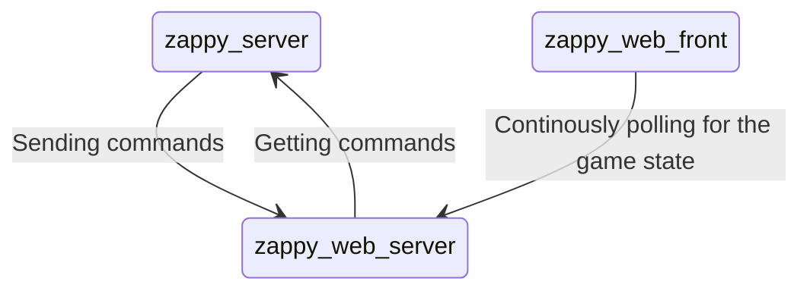
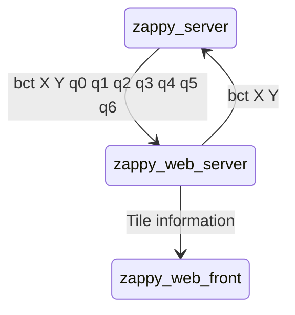

# Architecture & Schema

This is the representation of the data flow between the Zappy Server & the Zappy Web Server.

## Zappy Web Server

The Zappy Web Server is made of:
- a TCP client using UNIX sockets
- Flask server

## Schema for the main page

## Schema for the tile page

